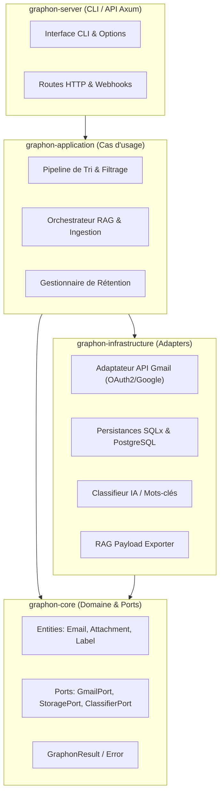
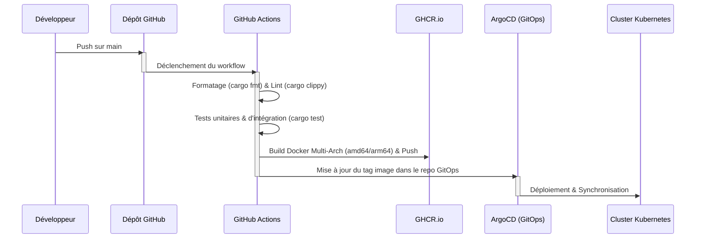

# Graphon 🏛️

**Graphon** (du grec ancien *Graphéion*, le bâtiment officiel des archives publiques) est un outil d'indexation, de tri automatisé et de nettoyage de boîte mail (Gmail) écrit en **Rust**. Conçu pour transformer une boîte de réception chaotique en une base de connaissances structurée, il prépare et organise vos données d'emails pour alimenter efficacement un système de **RAG (Retrieval-Augmented Generation)**.

S'inspirant de l'architecture moderne et robuste de **Pylos**, Graphon est structuré selon les principes de l'**Architecture Hexagonale (Clean Architecture)** afin de garantir performance, testabilité et extensibilité.

---

## 🚀 Objectifs du Projet

* **Indexation pour le RAG (Pipeline Rust) :** Extraction haute performance et structuration du texte des emails et pièces jointes (PDF, DOCX, XLSX, etc.) en chunks vectorisables.
* **Tri de Mail Intelligent & Classification :** Classification automatique des messages entrants, application de labels contextuels et priorisation.
* **Nettoyage des Indésirables :** Identification et archivage/suppression automatique des publicités, newsletters et spams.
* **Purge des Mails Périmés :** Application de règles de rétention strictes pour supprimer automatiquement les notifications éphémères (OTP, alertes obsolètes).

---

## 🛠️ Architecture Hexagonale (Inspirée de Pylos)

Graphon est structuré en plusieurs sous-crates Rust autonomes au sein d'un workspace Cargo :



### Rôle de chaque Crate (Backend Rust)

1. **`graphon-core` (Domaine)** : Contient le modèle métier pur, indépendant de toute technologie ou I/O.
   - **Entités** : `Email`, `Attachment`, `Label`, `RetentionRule`, `RagChunk`, `SearchResult`.
   - **Ports (Traits)** :
     - `GmailPort` : Récupération des messages, application/retrait de labels, suppression.
     - `ClassifierPort` : Classification sémantique ou heuristique de l'importance et des catégories via LLM.
     - `StoragePort` : Lecture/Écriture dans la base de données relationnelle.
     - `VectorStorePort` : Indexation et recherche sémantique des chunks d'emails.

2. **`graphon-infrastructure` (Adapters)** : Implémente les ports définis par le noyau domaine.
   - **Gmail Client Adapter** : Requêtes HTTP asynchrones vers l'API Google Gmail avec gestion OAuth2 et gestion résiliente des erreurs de jeton.
   - **Database Adapter** : Persistance avec PostgreSQL et **SQLx** (`sqlx`).
   - **Qdrant Adapter** : Connexion à la base de données vectorielle **Qdrant** pour stocker les embeddings et réaliser des recherches sémantiques RAG.
   - **AI Classifier Adapter** : Connexion à l'API Pylos pour classifier la pertinence des e-mails.

3. **`graphon-application` (Cas d'usage / Pipelines)** : Orchestre la logique applicative sous forme de pipelines de traitement asynchrones.
   - **Mail Sorting Pipeline`** : Ingestion -> Analyse & Nettoyage -> Classification sémantique -> Application des modifications Gmail.
   - **RAG Ingestion Pipeline (RagIndexer)** : Extraction du contenu textuel, découpage en chunks et enregistrement vectoriel dans Qdrant.
   - **Label Organizer** : Organisation automatique des labels, détection des catégories obsolètes et nettoyage sécurisé (avec détection et protection intégrée des étiquettes système/étoiles comme `GREEN_CIRCLE` ou `RED_STAR` pour éviter les blocages de l'API Gmail).

4. **`graphon-server` (Entrypoints)** :
   - **CLI Mode** : Exécution de tâches planifiées via Cron ou arguments CLI.
   - **Server Mode (Axum)** : API HTTP exposant des endpoints de statistiques, de listing, de synchronisation et de gestion de labels, sécurisés avec un mécanisme de redirection OAuth2 intelligent (redirection via `window.top.location.href` pour supporter l'intégration dans des portails iframe sans blocage CORS/Google Auth).

---

## 💻 Exemple de Code Rust (Architecture Hexagonale)

### Définition d'un Port dans `graphon-core`

```rust
// graphon-core/src/ports/gmail.rs
use crate::entities::Email;
use async_trait::async_trait;

#[async_trait]
pub trait GmailPort: Send + Sync {
    async fn fetch_unread_emails(&self) -> Result<Vec<Email>, crate::Error>;
    async fn apply_labels(&self, email_id: &str, labels: &[String]) -> Result<(), crate::Error>;
    async fn trash_email(&self, email_id: &str) -> Result<(), crate::Error>;
}
```

### Cas d'usage Pipeline dans `graphon-application`

```rust
// graphon-application/src/use_cases/sort_pipeline.rs
use graphon_core::ports::{GmailPort, ClassifierPort, StoragePort};
use std::sync::Arc;

pub struct MailSortingPipeline {
    gmail_client: Arc<dyn GmailPort>,
    classifier: Arc<dyn ClassifierPort>,
    storage: Arc<dyn StoragePort>,
}

impl MailSortingPipeline {
    pub async fn new(
        gmail_client: Arc<dyn GmailPort>,
        classifier: Arc<dyn ClassifierPort>,
        storage: Arc<dyn StoragePort>,
    ) -> Self {
        Self { gmail_client, classifier, storage }
    }

    pub async fn run(&self) -> Result<(), graphon_core::Error> {
        let emails = self.gmail_client.fetch_unread_emails().await?;
        
        for email in emails {
            // Étape 1 : Nettoyage / Détection pub & spams
            if self.classifier.is_spam_or_promo(&email).await? {
                self.gmail_client.apply_labels(&email.id, &["PROMO".to_string()]).await?;
                continue;
            }
            
            // Étape 2 : Classification d'importance
            let label = self.classifier.classify_importance(&email).await?;
            self.gmail_client.apply_labels(&email.id, &[label]).await?;
            
            // Étape 3 : Persistance pour le RAG
            self.storage.save_email(&email).await?;
        }
        Ok(())
    }
}
```

---

## ⚙️ Pipelines de CI/CD (GitHub Actions & GitOps)

Graphon s'intègre dans un flux de déploiement continu moderne et automatisé.



Le workflow GitHub Actions (`.github/workflows/ci.yml`) réalise les étapes suivantes :
1. **Validation Qualité** :
   - Formatage : `cargo fmt --check`
   - Analyse statique : `cargo clippy -- -D warnings`
   - Tests : `cargo test --verbose`
2. **Compilation & Packaging** :
   - Build multi-architecture avec **Docker Buildx** pour supporter `amd64` et `arm64`.
   - Publication automatique des images étiquetées vers **GHCR (GitHub Container Registry)**.
3. **Déploiement Continu (GitOps)** :
   - Mise à jour automatique des manifestes Kubernetes dans le dépôt GitOps dédié `jo3`.
   - Synchronisation par ArgoCD sur le cluster K8s.

---

## 🛠️ Installation & Démarrage

### Prérequis
* Rust 2021 (MSRV 1.75+)
* PostgreSQL (avec migrations SQLx installées)
* Fichier `credentials.json` (OAuth2) pour l'API Gmail à la racine du projet.

### Compilation
```bash
cargo build --release
```

### Exécution du Pipeline de Tri
```bash
./target/release/graphon-server --sync --clean
```

---

## 📄 Licence
Ce projet est sous licence MIT. Voir le fichier [LICENSE](LICENSE) pour plus de détails.
